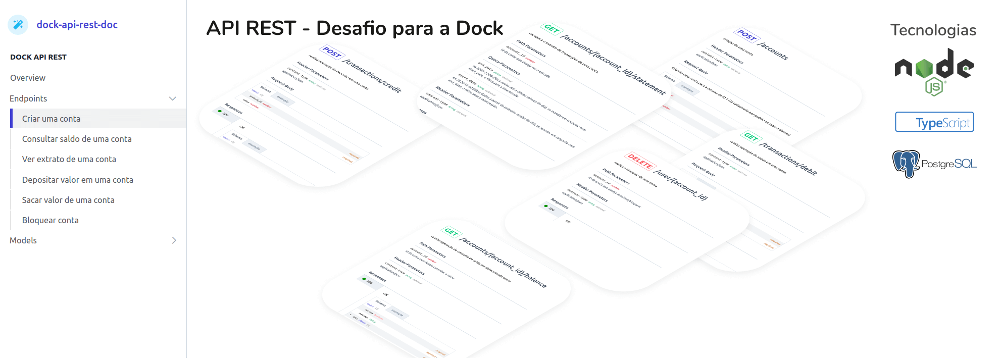
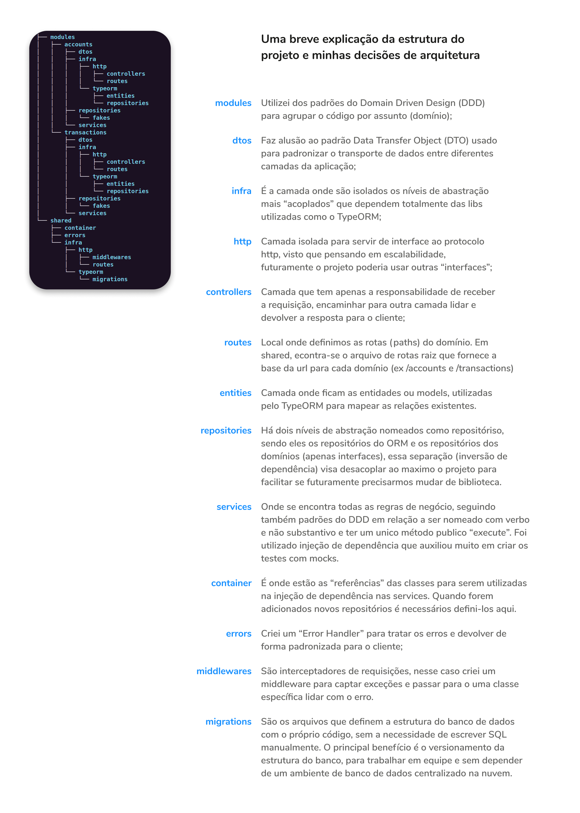

# Desafio Dock REST API

Veja quais foram os [critérios para esse desafio](./docs/desafio.pdf).
Data de entrega informada por email: até 09/12/2020.

## Manual de execução

Para rodar a aplicação localmente é necessário ter instalado em sua máquina tanto
o Docker quanto o Docker Compose

- [Docker](https://docs.docker.com/engine/install/) versão 19.03.3, build a872fc2f86 ou superior
- [docker-compose](https://docs.docker.com/compose/install/) versão 1.24.1, build 4667896b ou superior

Após instalar os pré-requisitos, na raiz do projeto você pode rodar dois comandos
para subir a aplicação

- `docker-compose up dock-database` // para subir o banco de dados
- `docker-compose up dock-api` // para subir a api

Não é necessário nenhuma outra configuração, já estará pronta para usar pela url:
http://localhost:3333. Mas calma, você pode ver os endpoints disponíveis na
[referência da API](https://sorteiu.stoplight.io/docs/dock-api-rest-doc/reference/Dock-API-REST.v1.yaml)

## Arquitetura do projeto

## Pontos que poderiam ser melhorados

- Adicionar validação nas rotas
- CPF único por pessoa
- O teste de integração tá consumindo a base de desenvolvimento invés da base de teste
- criar testes de integração pra outras rotas além da 'criar conta'
- Não permitir débito ou crédito com número negativo
- faz sentido atualizar o valor em saldo na tabela conta quando houver crédito ou débito
- faz sentido limitar o valor de saque por dia

## Considerações finais

Eu agradeceria muito por sugestões de melhorias ou formas diferentes de resolver problemas. Sou sempre aberto a opiniões diferentes, obrigado pela atenção!

Qualquer dúvida também pode me chamar no email:

Contato: gabrieldnrodrigues@gmail.com

[Visite meu linkedin](https://www.linkedin.com/in/gabrieldissotti/).

PS. (sempre tem um ps): Não fiz tudo o que eu queria, mas dei meu melhor no tempo que tive disponibilidade rs.

Acredito que cumpri todos os requisitos e diferenciais propostos. só fiquei em dúvida se consegui resolver o "Implementação de pontos de falha e resiliência", mas assim, se der erro a API não para de funcionar hahah.
